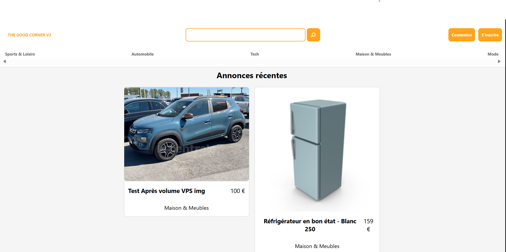

# The Good Corner V2


## Short Description

The Good Corner V2 is a full-stack classifieds application inspired by platforms like LeBonCoin. Users can browse, search, and manage ads with a responsive interface, secure authentication, and image upload support.

## Live Demo

[https://stg.the-good-corner.hyna.me](https://stg.the-good-corner.hyna.me)


## Key Features

- **Authentication** with JWT tokens stored in cookies for session management.
- **Ads CRUD**: create, read, update, and delete ads with categories, tags, and pictures.
- **Search & Filters**: filter ads by title, category, or tag.
- **Responsive UI** built with React and CSS media queries.
- **Image Upload** microservice handling file validation and storage.
- **CI/CD** pipeline with automated tests and Docker image publishing.
- **Testing** with unit tests and end-to-end Playwright tests.

## Tech Stack

- **Frontend**: React 18, Vite, Apollo Client, React Router, React Hook Form, Yup
- **Backend**: Node.js, TypeScript, Apollo Server, TypeGraphQL, TypeORM, argon2, JWT
- **Image Service**: Express, Multer
- **Database**: PostgreSQL
- **DevOps**: Docker, Docker Compose, Nginx, GitHub Actions
- **Testing**: Jest, Vitest, Playwright

## Architecture Overview

The project uses a containerized microservice architecture:

- **Backend**: GraphQL API built with Apollo Server and TypeGraphQL, communicating with PostgreSQL via TypeORM.
- **Frontend**: React single-page application served by Vite.
- **Image Service**: Express service for uploading and serving images.
- **Nginx Gateway**: Routes requests to frontend, backend, and image services.
- **PostgreSQL**: Stores users, ads, categories, tags, and pictures.

Services are orchestrated through Docker Compose with health checks.

## Installation

1. **Clone the repository**

   ```bash
   git clone git@github.com:hyna42/TGC-V2.git
   cd TGC-V2
   ```

2. **Set up environment variables**

   ```bash
   cp .env.exemple .env
   # Edit .env and update the values as needed
   ```

3. **Run with Docker Compose**
   ```bash
   docker compose up --build
   ```
   The app will be available through the Nginx gateway.

### Running locally without Docker

Install dependencies and start each service:

```bash
cd backend && npm install && npm start
cd frontend && npm install && npm start
cd img && npm install && npm start
```

## Testing Instructions

- **Backend**: `cd backend && npm test`
- **Frontend**: `cd frontend && npm test`
- **Image Service**: `cd img && npm test`
- **End-to-end**: `cd e2e && npx playwright test`

## License

This project is licensed under the MIT License.
